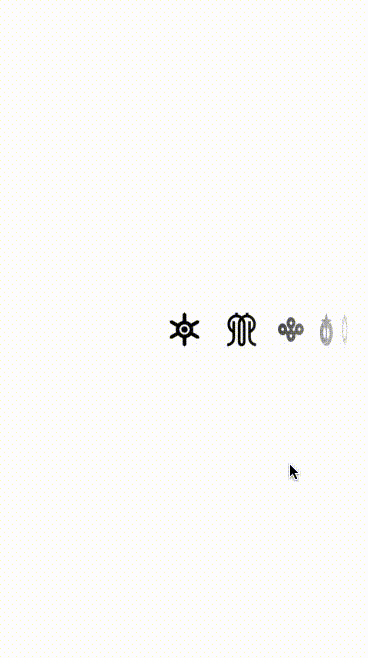

AKPickerView
============

A simple yet customizable horizontal picker view.

Works on iOS 6, 7 and 8.

*__News__: AKPickerView now supports __images__!*

Installation
------------

Use [CocoaPods](http://cocoapods.org)

    pod "AKPickerView"

…or simply add AKPickerView.h/m into your project.

Usage
-----

*__Caveat__*: From version 2.0, `dataSource` separated from `delegate`. When you updated it, check new how to use below.

1. Instantiate and set `delegate` and `dataSource` as you know,

        self.pickerView = [[AKPickerView alloc] initWithFrame:<#frame#>];
        self.pickerView.delegate = self;
        self.pickerView.dataSource = self;

1. then specify the number of items using `AKPickerViewDataSource` methods,

        - (NSUInteger)numberOfItemsInPickerView:(AKPickerView *)pickerView;
	
1. and specify contents to be shown. You can use either texts or images:

        - (NSString *)pickerView:(AKPickerView *)pickerView titleForItem:(NSInteger)item;
        // OR
        - (UIImage *)pickerView:(AKPickerView *)pickerView imageForItem:(NSInteger)item;
	
    - Using both texts and images are currently not supported. When you implement both, `-pickerView:titleForItem` will be called and the other won't. 
    - You currently cannot specify image sizes; AKPickerView shows the original image in its original size. Resize your images in advance if you need.

1. You can change its appearance with properties below.

        @property (nonatomic, strong) UIFont *font;
        @property (nonatomic, strong) UIFont *highlightedFont;
        @property (nonatomic, strong) UIColor *textColor;
        @property (nonatomic, strong) UIColor *highlightedTextColor;
        @property (nonatomic, assign) CGFloat interitemSpacing;
        @property (nonatomic, assign) CGFloat fisheyeFactor;
    
    - All cells are laid out depending on the largest font, so large differnce between the sizes of *font* and *highlightedFont* is NOT recommended.  
    - fisheyeFactor property affects perspective distortion. The range is 0.0 - 1.0; slight value such as 0.0001 is recommended.

1. After all settings, **never forget to reload your picker**.

    [self.pickerView reloadData];
    
Option: You can use `AKPickerViewDelegate` method to observe selection changes:

    - (void)pickerView:(AKPickerView *)pickerView didSelectItem:(NSInteger)item;
    
Additionally, you can use `UIScrollViewDelegate` method to observe scrolling.
    
For more detail, see the sample project.

Contact
-------

@akkyie http://twitter.com/akkyie

License
-------
See LICENSE.
